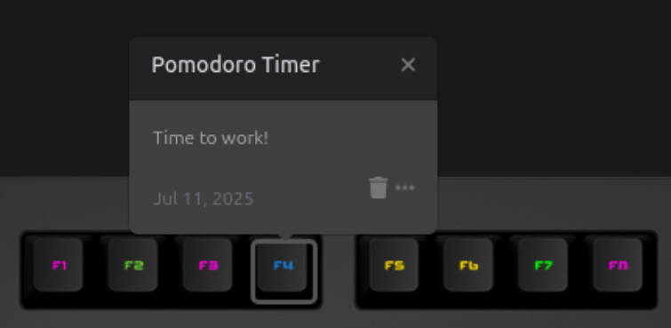

# Pomodoro++ – Das Keyboard Applet

Stay productive with a simple, visual work/break timer that runs directly on your Das Keyboard Q.  
The applet uses color-coded lighting to show whether it’s time to focus — or time to rest.

## 🧠 What Is Pomodoro++?

This applet helps structure your day using alternating periods of work and rest.  
It’s inspired by techniques like Pomodoro but gives you the freedom to set your **own durations**.

Whether you prefer 25/5, 60/20, or something custom — your keyboard will guide your rhythm without distractions.

## ⏱ Applet Behavior

- 🔵 **Blue breathe effect** when it's time to **focus**
- 🟢 **Green blinking** when it's time to **take a break**
- Automatically alternates between work and break periods
- Keeps time between polls — your cycle won't reset or drift

## ⚙️ Setup Instructions

1. **Install this applet** in the Das Keyboard Q software
2. **Assign the applet to any key** on your keyboard
3. **Configure your preferred durations**
4. **Watch the key light up** based on whether it's time to work or time to take a break!
